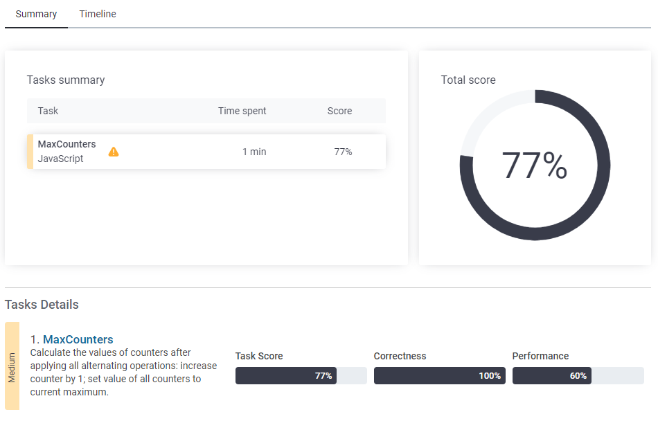
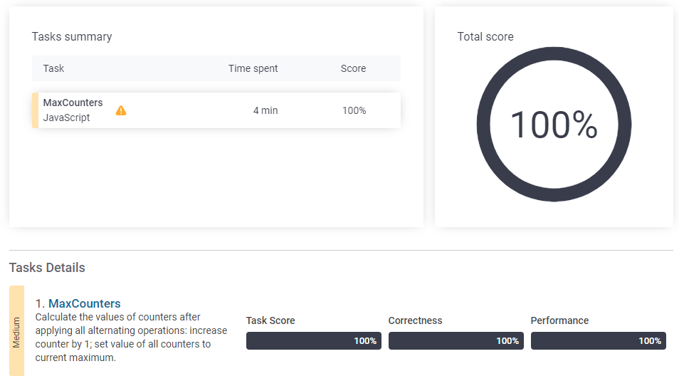

## 문제 이름

[문제 링크](https://app.codility.com/programmers/lessons/4-counting_elements/max_counters/)

### JavaScript - 풀이2

```javascript
function solution(N, A) {
    let answer = Array(N).fill(0);
    let maxCount = 0;
    for (let i = 0; i < A.length; i++) {
        const index = A[i] - 1;
        if (index == N) {
            answer = Array(N).fill(maxCount);
            continue;
        }
        answer[index]++;
        if (maxCount < answer[index]) maxCount = answer[index];
    }
    return answer;
}
```

-

### 접근방법

1. 반복문을 돌며 나온 `A[i]의 값을 answer의 인덱스로 참조해 1씩 더해줌

2. `N+1` 값(`A[i] -1 == N`) 일 경우 모든 원소가 maxCount인 배열을 만들어줌

-   시간 초과 오류 발생

    

-   for문에 Arrays.fill()이 있으므로 시간복잡도는 O(N\*M)

-   참고로 `answer = Array(N).fill(maxCount);` 가 `answer = answer.map(x => maxCount)`보다 더 **`빠르다`**

### JavaScript - 풀이2

```javascript
function solution(N, A) {
    let answer = Array(N).fill(0);
    let currentMaxCount = 0;
    let maxCount = 0;
    for (let i = 0; i < A.length; i++) {
        const index = A[i] - 1;
        if (index == N) {
            maxCount = currentMaxCount;
            continue;
        }
        if (answer[index] < maxCount) {
            answer[index] = maxCount;
        }
        answer[index]++;
        if (currentMaxCount < answer[index]) currentMaxCount = answer[index];
    }
    for (let i = 0; i < answer.length; i++) {
        if (answer[i] < maxCount) {
            answer[i] = maxCount;
        }
    }
    return answer;
}
```

### 접근 방법



-   시간복잡도를 줄이기 위해 반복문 내에 반복 작업을 삭제

-   각 값이 1씩 더해질 때 currentMaxCount를 최댓값으로 업데이트

-   N+1값이 나왔을 때 `maxCount`를 currentMaxCount로 업데이트

-   값을 1씩 더해주기 전, maxCount와 비교 후 작을 경우 maxCount로 먼저 만들어줌

-   값이 갱신이 안될 수도 있으니 뒤에 모든 `answer`에 대해 maxCount 이상으로 값을 만들어줌
