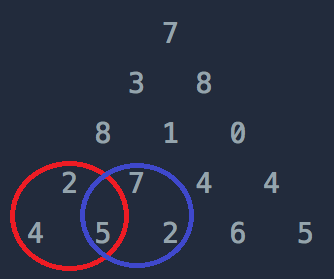

## 문제 이름

[문제 링크](https://programmers.co.kr/learn/courses/30/lessons/43105)

### Java

```java
class Solution {
    public int solution(int[][] triangle) {
        int[][] dp = new int[triangle.length+2][triangle.length+2];

        for(int i=0; i<triangle.length; i++){
            for(int j=1; j<triangle.length-i+1; j++){
                int left = dp[i][j] + triangle[triangle.length-i-1][j-1];
                int right = dp[i][j+1] + triangle[triangle.length-i-1][j-1];
                dp[i+1][j] = Math.max(left, right);
            }
        }
        return dp[dp.length-2][1];
    }
}
```

- 소요시간 : 20분

### 접근방법

1.  노드의 최댓값 = `Math.min(왼쪽 자식 노드의 최댓값, 오른쪽 자식 노드의 최댓값) + 현재 노드의 값`이다.

    예를 들어, 현재 노드가 8이라면

    

    위 그림에서 왼쪽 자식 노드 최댓값, 오른쪽 자식 노드의 최댓값을 고를 것이고

    2가 부모인 왼쪽 서브트리에서의 최댓값은 7, 7이 부모인 오른쪽 서브트리에서의 최댓값은 12이다.

    따라서 노드 8의 최댓값은 `Math(7, 12) + 8 = 20` 이다.

2.  위 방식으로 예제에 대한 DP 배열을 작성하면

    ```
    0  0  0  0  0  0  0
    0  4  5  2  6  5  0
    0  7 12  10 10 0  0
    0 20 13  10 0  0  0
    0 23 21  0  0  0  0
    0 30  0  0  0  0  0
    ```

    이고 각 배열의 값은 현재 노드에서의 최댓값을 의미한다.

3.  위 방식을 식으로 나타내면

    `dp[i+1][j] = Math.max(dp[i][j], dp[j+1]) + triangle[triangle.length-i-1][j-1]`

    이다.

4.  배열의 길이가 `triangle.length+2`인 이유는 첫 번째 원소들을 결정하기 위해서 부모 노드의 갯수를 1개 더 많이 설정해줘야 index에러가 발생하지 않기 때문이다. (예외 케이스로 빼주기 귀찮아서)
